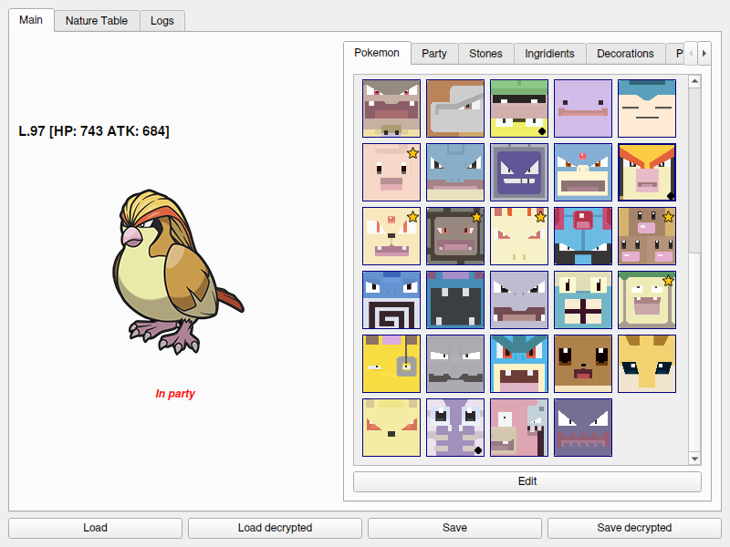

# PQHex

The Pokemon Quest save editor

works on windows, linux and macOS.

chinese version is not supported and never will.

**_not affiliated with PKHeX_**

#### limitations
- cannot create new pokemons
- cannot create new stones
- skill stone bonus number is hard coded in the game, you can edit available ones but cannot add more
- pokedex shiny flag is not implemented

#### supported game platforms
- switch

Copyright (C) 2025 kylon GPLv3

### credits
- [pqsave](https://github.com/Thealexbarney/PqSave)
- star, starnb icons by [Pixel Perfect](https://www.flaticon.com/authors/pixel-perfect)
- nature table by `Armads` from cheeseworld forum
- seerebi for icons and game details
- pokemondb for icons
- bulbapedia for icons and other info
- some gbatemp posts
- others i don't remember for more game details
